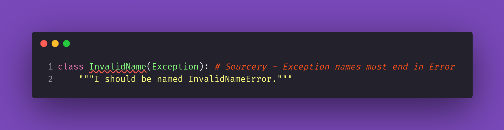
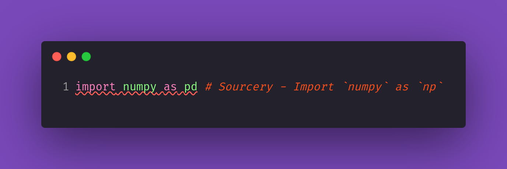
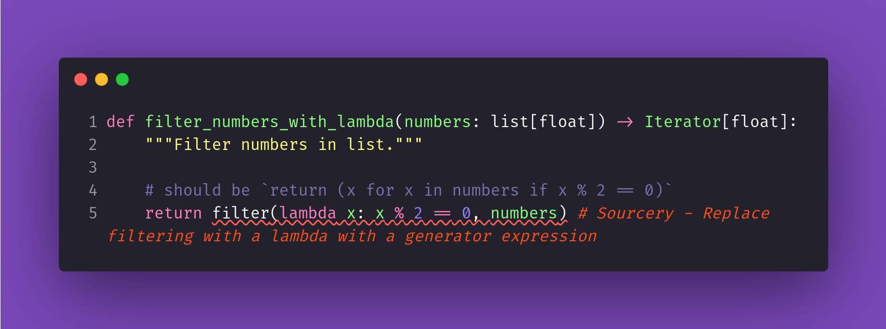

# Sourcery's Google Python Style Guide Rules Demo

Demonstration repository using [Sourcery](https://sourcery.ai/) to enforce the [Google Python Style Guide (GPSG)](https://docs.sourcery.ai/Reference/Custom-Rules/gpsg/).

## Overview

<!-- 
	TODO: add this section, describing what exactly we want to achieve here, and why
	this is useful to our users.
-->
_**<span style="color:gray">Coming soon!</span>**_

## Getting Started

<!-- 
	TODO: add this section, describing how to clone this repository and get started in
	order to see Sourcery in action
-->
_**<span style="color:gray">Coming soon!</span>**_

## Integrations

### Pre-commit

<!-- TODO: add this section -->
_**<span style="color:gray">Coming soon!</span>**_

### GitHub Action

<!-- TODO: add this section -->
_**<span style="color:gray">Coming soon!</span>**_

## Navigating the Examples

The directory [`examples`](./examples) contains example files with code that either violates or not one or more of the GPSG rules.

### Using an IDE

Try opening those files in your IDE with the [Sourcery extension](https://docs.sourcery.ai/Guides/Getting-Started/#ides) enabled to see inline diagnostics of the violations those files contain.

The following images illustrate some of the diagnostics you may find:





### Using the CLI

Trying out [Sourcery CLI](https://docs.sourcery.ai/Guides/Getting-Started/Command-Line/) in the examples is as simple as running the following command:

```bash
sourcery review examples
```

Sourcery will then show all of the violations to the GPSG it finds together with a summary at the end. The following block is a truncated example of the output you may see:
```
$ sourcery review examples
examples/individual_rules/conditional_expression_rules.py:19 no-complex-if-expressions
examples/individual_rules/conditional_expression_rules.py:24 no-complex-if-expressions
examples/individual_rules/decorator_rules.py:15-21 do-not-use-staticmethod
examples/individual_rules/default_iterator_and_operator_rules.py:17 do-not-use-has-key
examples/individual_rules/default_iterator_and_operator_rules.py:28 do-not-use-has-key
examples/individual_rules/default_iterator_and_operator_rules.py:40-43 do-not-use-has-key

... # this example is truncated!!

examples/individual_rules/type_annotations_rules.py:11-13 require-parameter-annotation
examples/individual_rules/type_annotations_rules.py:18-20 require-parameter-annotation
examples/individual_rules/type_annotations_rules.py:28-30 require-parameter-annotation
examples/individual_rules/type_annotations_rules.py:52-54 require-return-annotation
examples/individual_rules/type_annotations_rules.py:59-61 require-return-annotation

─────────────────────────────────────── Overview ───────────────────────────────────────

 • 12 files scanned.
 • 70 issues detected.

Issues by Type

 • 7 issues could be fixed by Sourcery. Run sourcery review --in-place
 • 63 issues need to be fixed manually.

Issues by Rule ID
┏━━━━━━━━━━━━━━━━━━━━━━━━━━━━━━━━━━━━━━━━━━┳━━━━━━━┓
┃ Rule ID                                  ┃ Count ┃
┡━━━━━━━━━━━━━━━━━━━━━━━━━━━━━━━━━━━━━━━━━━╇━━━━━━━┩
│ snake-case-arguments                     │     8 │
│ snake-case-variable-declarations         │     8 │
│ upper-camel-case-classes                 │     5 │
│ errors-named-error                       │     4 │
│ no-complex-if-expressions                │     4 │
│ no-relative-imports                      │     4 │
│ avoid-single-character-names-functions   │     3 │
│ do-not-use-has-key                       │     3 │
│ docstrings-for-classes                   │     3 │
│ no-wildcard-imports                      │     3 │
│ require-parameter-annotation             │     3 │
│ avoid-global-variables                   │     2 │
│ avoid-single-character-names-variables   │     2 │
│ docstrings-for-functions                 │     2 │
│ filter-lambda-to-generator               │     2 │
│ lambdas-should-be-short                  │     2 │
│ map-lambda-to-generator                  │     2 │
│ require-return-annotation                │     2 │
│ avoid-trivial-properties                 │     1 │
│ do-not-use-staticmethod                  │     1 │
│ docstrings-for-modules                   │     1 │
│ name-type-suffix                         │     1 │
│ no-long-functions                        │     1 │
│ use-standard-name-for-aliases-numpy      │     1 │
│ use-standard-name-for-aliases-pandas     │     1 │
│ use-standard-name-for-aliases-tensorflow │     1 │
├──────────────────────────────────────────┼───────┤
│ Total                                    │    70 │
└──────────────────────────────────────────┴───────┘
```

> 📝 We may add more cool examples in the future, so the actual issue count that you see
> may be even higher than in this example.

### Individual Rules

The directory [`examples/individual_rules`](./examples/individual_rules) contains individual examples for each Google Python Style Guide rule defined in the root Sourcery configuration file [`.sourcery.yaml`](./.sourcery.yaml). You can use those examples to see each rule in action separately and decide how well they fit into your team's requirements.

The examples are grouped in files according to the Google Python Style Guide sections they correspond to:

* [2.2 Import Rules](https://docs.sourcery.ai/Reference/Custom-Rules/gpsg/#22-import-rules): [`import_rules.py`](./examples/individual_rules/import_rules.py)
* [2.4 Exception Rules](https://docs.sourcery.ai/Reference/Custom-Rules/gpsg/#24-exception-rules): [`exception_rules.py`](./examples/individual_rules/exception_rules.py)
* [2.5 Global Variable Rules](https://docs.sourcery.ai/Reference/Custom-Rules/gpsg/#25-global-variable-rules): [`global_variable_rules.py`](./examples/individual_rules/global_variable_rules.py)
* [2.8 Default Iterator and Operator Rules](https://docs.sourcery.ai/Reference/Custom-Rules/gpsg/#28-default-iterator-and-operator-rules): [`default_iterator_and_operator_rules.py`](./examples/individual_rules/default_iterator_and_operator_rules.py)
* [2.10 Lambda Function Rules](https://docs.sourcery.ai/Reference/Custom-Rules/gpsg/#210-lambda-function-rules): [`lambda_function_rules.py`](./examples/individual_rules/lambda_function_rules.py)
* [2.11 Conditional Expression Rules](https://docs.sourcery.ai/Reference/Custom-Rules/gpsg/#211-conditional-expression-rules): [`conditional_expression_rules.py`](./examples/individual_rules/conditional_expression_rules.py)
* [2.17 Decorator Rules](https://docs.sourcery.ai/Reference/Custom-Rules/gpsg/#217-decorator-rules): [`decorator_rules.py`](./examples/individual_rules/decorator_rules.py)
* [2.21 Type Annotation Rules](https://docs.sourcery.ai/Reference/Custom-Rules/gpsg/#221-type-annotation-rules): [`type_annotations_rules.py`](./examples/individual_rules/type_annotations_rules.py)
* [3.8 Docstring and Comment Rules](https://docs.sourcery.ai/Reference/Custom-Rules/gpsg/#38-docstring-and-comment-rules): [`docstring_and_comment_rules.py`](./examples/individual_rules/docstring_and_comment_rules.py)
* [3.15 Getter and Setter Rules](https://docs.sourcery.ai/Reference/Custom-Rules/gpsg/#315-getter-and-setter-rules): [`getter_and_setter_rules.py`](./examples/individual_rules/getter_and_setter_rules.py)
* [3.16 Naming Rules](https://docs.sourcery.ai/Reference/Custom-Rules/gpsg/#316-naming-rules): [`naming_rules.py`](./examples/individual_rules/naming_rules.py)
* [3.18 Function Length Rules](https://docs.sourcery.ai/Reference/Custom-Rules/gpsg/#318-function-length-rules): [`function_length_rules.py`](./examples/individual_rules/function_length_rules.py)

### Real-World Examples

<!-- TODO: add this section -->
_**<span style="color:gray">Coming soon!</span>**_


## How to get this working on my project

<!-- TODO: add this section -->
_**<span style="color:gray">Coming soon!</span>**_
